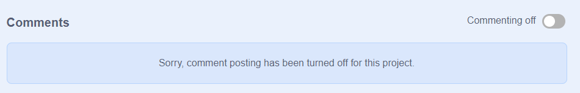
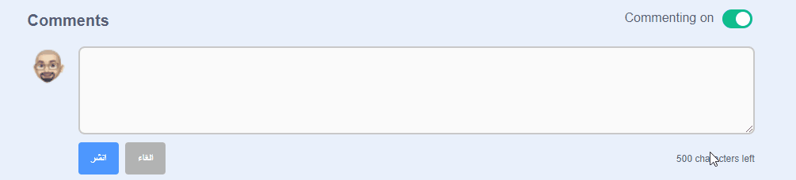
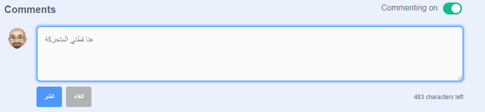
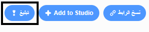

يوفر سكراتش القدرة على التعليق على مشاريعك الخاصة ومشاريع الآخرين. إذا كنت لا تريد السماح للأشخاص بالتعليق على مشروعك ، فيجب عليك إيقاف التعليق.

{:width="300px"}

إذا كنت سعيدًا وتشعر بالأمان للسماح للأشخاص بكتابة تعليقات على مشروعك ، فيمكنك ترك التعليق الأول.

--- no-print ---

--- /no-print ---

--- print-only ---

{:width="300px"}

--- /print-only ---

إذا كنت تعتقد أن مشروعًا أو تعليقًا لئيماً أو مهينًا أو عنيفًا للغاية أو غير ملائم بأي طريقة أخرى ، فانقر فوق **إبلاغ** في صفحة المشروع لإعلام سكراتش بذلك.

{:width="250px"}

اقرأ [إرشادات مجتمع سكراتش](https://scratch.mit.edu/community_guidelines){: target = "_ blank"} حتى تعرف كيف يمكنك أنت والآخرون الحفاظ على مجتمع ودي ومبدع.
