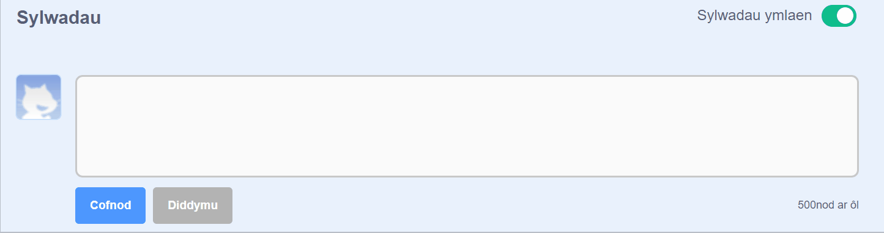
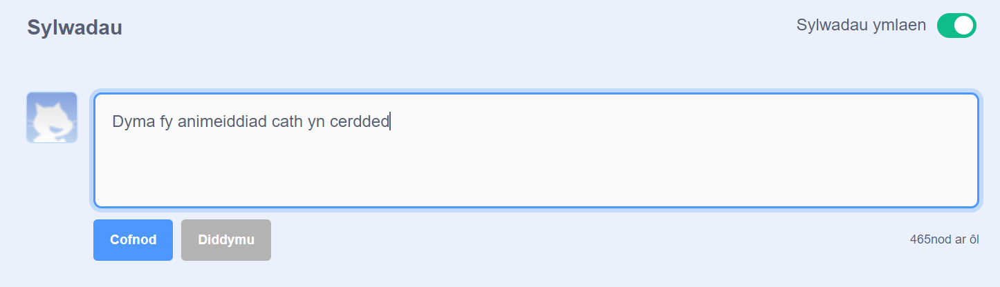

Mae Scratch yn darparu'r gallu i roi sylwadau ar dy brosiectau di a phrosiectau pobl eraill. Os nad wyt ti am ganiatáu i bobl roi sylwadau ar dy brosiect, dylet ti ddiffodd gwneud sylwadau. I ddiffodd sylwadau, gosoda'r llithrydd uwchben y blwch **Sylwadau** i **Sylwadau wedi diffodd**:

{:width="300px"}

Os wyt ti'n hapus ac yn teimlo'n ddigon diogel i ganiatáu i bobl ysgrifennu sylwadau ar dy brosiect, galli dy adael y sylw cyntaf:

--- no-print ---

--- /no-print ---

--- print-only ---

{:width="300px"}

--- /print-only ---

Os wyt ti'n meddwl bod sylw neu brosiect yn gas, yn sarhaus, yn rhy dreisgar, neu'n amhriodol fel arall, clicia'r botwm **Adrodd** i adael i Dîm Scratch wybod amdano. I riportio sylw, clicia'r botwm **Adrodd** uwchben y sylw. I riportio prosiect, clicia'r botwm **Adrodd** ar Dudalen y Prosiect:

{:width="250px"}

Darllena [Ganllawiau Cymunedol Scratch](https://scratch.mit.edu/community_guidelines){:target="_blank"} i ddysgu sut y galli di a phobl eraill gynnal cymuned gyfeillgar a chreadigol.
