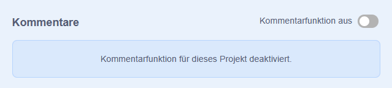
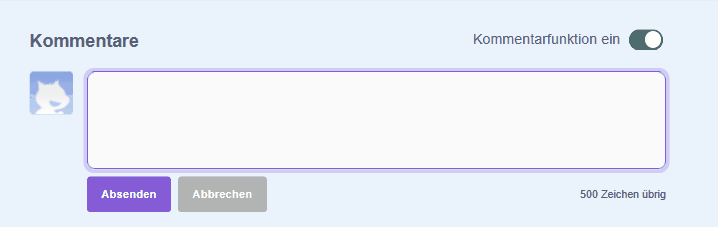
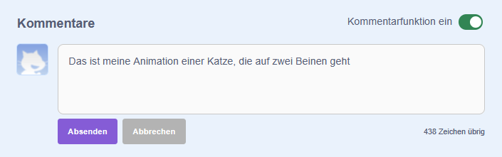
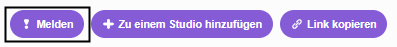

In Scratch kannst du Kommentare zu Projekten posten (eigene Projekte und Projekte von Anderen). Falls du nicht willst, dass jemand dein Projekt kommentiert, schalte die Kommentare aus. Gehe dazu zur Projektseite und bewege den Schieberegler oberhalb des Felds **Kommentare** auf **Kommentarfunktion aus**:

{:width="300px"}

Wenn du keine Bedenken hast, dass dein Projekt kommentiert wird, kannst du den ersten Kommentar posten:

--- no-print ---

--- /no-print ---

--- print-only ---

{:width="300px"}

--- /print-only ---

Wenn du einen Kommentar oder ein Projekt gemein, beleidigend, zu gewalttätig oder auf andere Weise unangebracht findest, melde ihn über den Knopf **Melden** an das Scratch-Team. Klicke auf den Knopf **Melden** oberhalb des Kommentars, um ihn zu melden. Klicke auf den Knopf **Melden** auf der Projektseite, um es zu melden:

{:width="250px"}

Lies die [Scratch-Community-Regeln](https://scratch.mit.edu/community_guidelines){:target="_blank"}, um zu erfahren, wie du und Andere dafür sorgt, dass die Community ein einladender und kreativer Ort bleibt.
