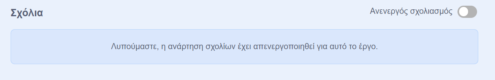
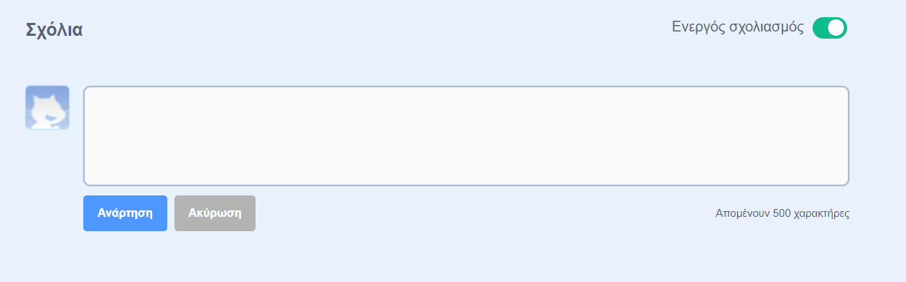
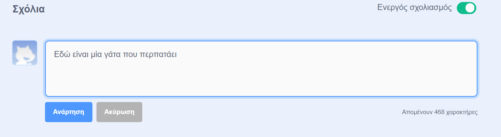
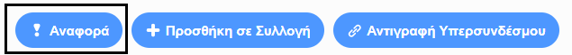

Το Scratch παρέχει τη δυνατότητα σχολιασμού τόσο των έργων σου όσο και των έργων άλλων. Αν δεν θες να επιτρέψεις σε άλλους να σχολιάζουν το έργο σου, θα πρέπει να απενεργοποιήσεις τα σχόλια. To turn off commenting, go to the Project Page and set the slider above the **Comments** box to **Commenting off**:

{:width="300px"}

If you are happy and feel safe to allow people to write comments on your project, you can leave the first comment:

--- no-print ---

--- /no-print ---

--- print-only ---

{:width="300px"}

--- /print-only ---

If you think a comment or project is mean, insulting, too violent, or otherwise inappropriate, click the **Report** button to let the Scratch Team know about it. To report a comment, click the **Report** button above the comment. To report a project, click the **Report** button on the Project Page:

{:width="250px"}

Read the [Scratch Community Guidelines](https://scratch.mit.edu/community_guidelines){:target="_blank"} so that you know how you and others can maintain a friendly and creative community.
