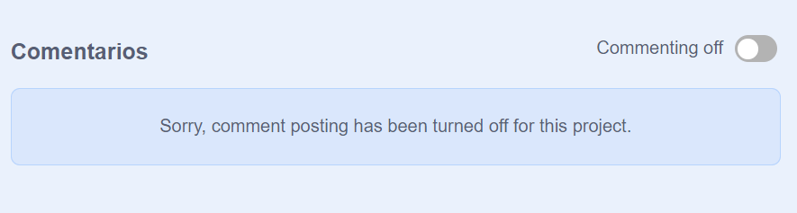
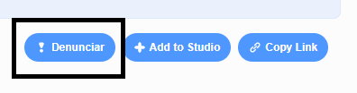

Scratch ofrece la posibilidad de comentar sobre proyectos propios y ajenos. Si no quieres permitir que las personas comenten sobre tu proyecto, debes desactivar los comentarios. Para desactivar los comentarios, ve a la Página del Proyecto y fija el control deslizante sobre el cuadro **Comentarios** en la posición **Comentarios desactivados** (Commenting off):

{:width="300px"}

Si estás contento y te sientes seguro de permitir que las personas escriban comentarios sobre tu proyecto, puedes dejar el primer comentario:

--- no-print ---

--- /no-print ---

--- print-only ---

{:width="300px"}

--- /print-only ---

Si crees que un proyecto o comentario es cruel, insultante, demasiado violento o inapropiado, haz clic en el botón **Denunciar** en la página del proyecto para que el equipo de Scratch lo sepa. Para denunciar un comentario, haz clic en el botón **Denunciar** encima del comentario. Para denunciar un proyecto, haz clic en el botón **Denunciar** en la página del proyecto:

{:width="250px"}

Lee las de [Reglas de la Comunidad de Scratch](https://scratch.mit.edu/community_guidelines){:target="_blank"} para saber cómo tú y los demás pueden mantener una comunidad amigable y creativa.

