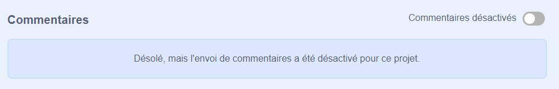
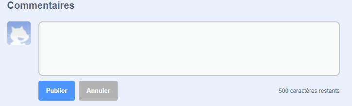
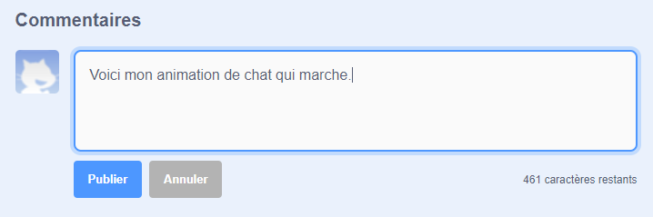
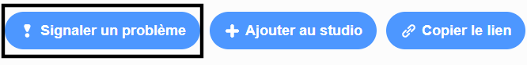

Scratch offre la possibilité de commenter tes propres projets et ceux des autres. Si tu ne souhaites pas autoriser les utilisateurs à commenter ton projet, tu dois désactiver les commentaires. Pour désactiver les commentaires, va à la page Projet et règle le curseur au-dessus de la case **Commentaires** **Commentaire désactivé** :

{:width="300px"}

Si tu es d'accord et que tu te sens à l'aise pour permettre aux gens d'écrire des commentaires sur ton projet, tu peux laisser le premier commentaire :

--- no-print ---

--- /no-print ---

--- print-only ---

{:width="300px"}

--- /print-only ---

Si tu penses qu'un projet ou un commentaire est méchant, insultant, trop violent ou inapproprié, clique sur le bouton **Signaler un problème** sur la page du projet pour en informer Scratch. Pour signaler un commentaire, clique sur le bouton **Signaler** au-dessus du commentaire. Pour signaler un projet, clique sur le bouton **Signaler un problème** sur la page Projet :

{:width="250px"}

Lis le [règlement de la communauté Scratch](https://scratch.mit.edu/community_guidelines){:target="_ blank"} pour savoir comment toi et les autres pouvez maintenir une communauté conviviale et créative.
