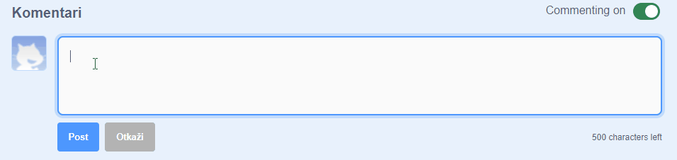
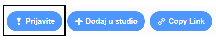

Scratch pruža mogućnost komentiranja vlastitih i tuđih projekata. Ako ne želiš dopustiti ljudima da komentiraju tvoj projekt, moraš isključiti opciju komentiranja. Da isključiš opciju komentiranja, idi na stranicu projekta i postavi klizač iznad okvira **Komentari** na **Commenting off (Komentiranje isključeno)**:

{:width="300px"}

Ako se osjećaš sigurno i želiš dopustiti ljudima da komentiraju tvoj projekt, možeš ostaviti prvi komentar:

--- no-print ---

--- /no-print ---

--- print-only ---

{:width="300px"}

--- /print-only ---

Ako misliš da je komentar ili projekt zločest, uvredljiv, previše nasilan ili na neki drugi način neprikladan, klikni na gumb **Prijavite** da o tome obavijestiš Scratch tim. Da prijaviš komentar, klikni na gumb **Prijavite** iznad komentara. Da prijaviš projekt, klikni na gumb **Prijavite** na stranici projekta:

{:width="250px"}

Pročitaj [Smjernice Scratch zajednice](https://scratch.mit.edu/community_guidelines){:target="_blank"} da saznaš kako ti i drugi ljudi možete održati prijateljsku i kreativnu zajednicu.
