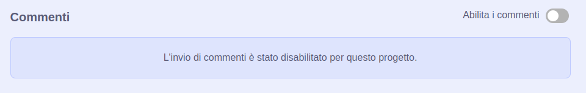
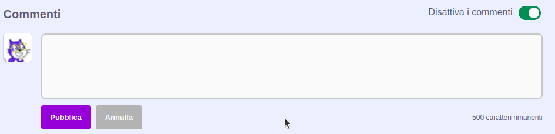

Scratch dà la possibilità di commentare i tuoi progetti e quelli di altre persone. Se non vuoi consentire alle persone di commentare il tuo progetto, puoi disattivare i commenti. Per disattivare i commenti, vai alla Pagina del Progetto e sposta il cursore sopra la casella **Commenti** su **Commenti disattivati**:

{:width="300px"}

Se sei soddisfatto e ti senti al sicuro permettendo alle persone di scrivere commenti sul tuo progetto, puoi lasciare il tuo primo commento:

--- no-print ---

--- /no-print ---

--- print-only ---

{:width="300px"}

--- /print-only ---

Se ritieni che un commento o un progetto sia negativo, offensivo, troppo violento o inappropriato, fai clic sul pulsante **Segnala** per comunicarlo allo Scratch Team. Per segnalare un commento, fai clic sul pulsante **Segnala** sopra il commento. Per segnalare un progetto, fai clic sul pulsante **Segnala** sulla Pagina del Progetto:

{:width="250px"}

Leggi le [Linee guida della comunità di Scratch](https://scratch.mit.edu/community_guidelines){:target="_blank"} in modo da sapere come, tu e gli altri, potete mantenere una comunità amichevole e creativa.
