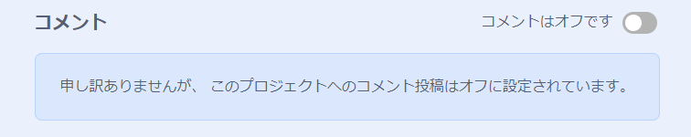
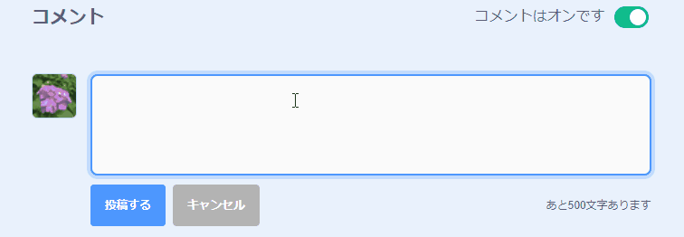
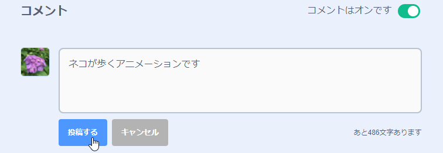

Scratchは自分や他の人のプロジェクトにコメントする機能を提供しています。 他の人にプロジェクトへのコメントを許可したくない場合は、コメントをオフにする必要があります。 コメントをオフにするには、**コメント**ボックスの上のスライダを「**コメントはオフです**」に設定します。

{:width="300px"}

人々にあなたのプロジェクトへコメントすることを喜んで不安なく許可できると感じるならば、最初のコメントを残すことができます。

--- no-print ---

--- /no-print ---

--- print-only ---

{:width="300px"}

--- /print-only ---

コメントやプロジェクトが下品だったり、侮辱的だったり、非常に暴力的だったり、あるいは不適切だと思う場合は、**報告**ボタンをクリックしてScratchチームに知らせてください。 コメントを報告するにはコメントの上にある**報告**ボタンをクリックします。 プロジェクトを報告するにはプロジェクトページにある**報告**ボタンをクリックします。

{:width="250px"}

[Scratchコミュニティーのガイドライン](https://scratch.mit.edu/community_guidelines){:target="_blank"}を読んで、自分や他の人が友好的で創造的なコミュニティをどうやって維持するのか理解してください。
