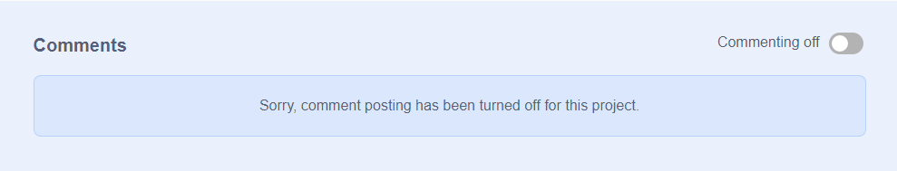
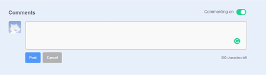
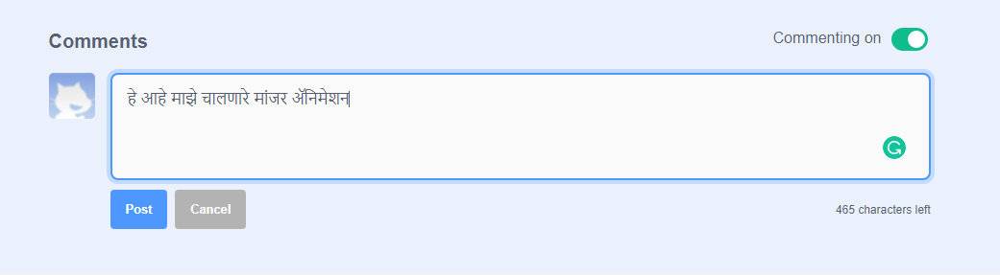

स्क्रॅच तुमच्या स्वतःच्या आणि इतर लोकांच्या प्रकल्पांवर टिप्पणी देण्याची क्षमता प्रदान करते. तुम्ही तुमच्या प्रकल्पांवर लोकांना टिप्पणी देऊ असे इच्छित असल्यास तुम्ही टिप्पणी देणे हे बंद केले पाहिजे. टिप्पणी बंद करण्यासाठी, प्रकल्प पृष्ठावर जा आणि **टिप्पणी** बॉक्स वरील स्लायडर **बंद टिप्पणी**: असा करा

{:width="300px"}

जर तुम्हाला तुमच्या प्रकल्पावर लोकांना टिप्पण्या लिहू देण्यास सुरक्षित वाटत असेल आणि आनंद वाटत असेल तर तुम्ही प्रथम टिप्पणी देऊ शकता:

--- / no-print ---

--- /no-print ---

--- print-only ---

{:width="300px"}

--- /print-only ---

जर तुम्हाला असे वाटले की एखादा प्रकल्प किंवा टिप्पणी निंदनीय आहे, अपमानकारक आहे, खूप हिंसक आहे किंवा अन्यथा अयोग्य वाटत असेल तर स्क्रॅचला त्याबद्दल कळवण्यासाठी प्रोजेक्ट पृष्ठावरील **अहवाल** बटण दाबावे. टिप्पणीची तक्रार करण्यासाठी **अहवाल** बटणावर क्लिक करा. प्रकल्पाची तक्रार करण्यासाठी **अहवाल** बटणावर क्लिक करा:

{:width="250px"}

[स्क्रॅच समुदाय मार्गदर्शकतत्त्वे](https://scratch.mit.edu/community_guidelines){:target="_blank"} वाचा जेणेकरून तुम्ही आणि इतर सर्व मिळून मैत्रीपूर्ण आणि सर्जनशील समुदाय कसा टिकवता येईल हे आपल्याला माहिती होईल.
