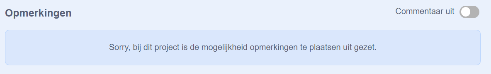

Scratch biedt de mogelijkheid om opmerkingen te schrijven bij je eigen en andermans projecten. Als je niet wilt dat mensen opmerkingen schrijven bij je project, moet je opmerkingen uitschakelen. Om opmerkingen uit te schakelen, ga je naar de projectpagina en stel je de schuifregelaar boven het **Opmerkingen** vak in op **Opmerkingen uit**:

{:width="300px"}

Als je je goed en veilig voelt om mensen toe te staan opmerkingen bij je project te schrijven, kun je zelf de eerste opmerking achterlaten:

Dit project behandelt elementen uit de volgende onderdelen van de [Raspberry Pi Digital Making Curriculum](http://rpf.io/curriculum){:target="_blank"}:

--- /no-print ---

--- /challenge ---

{:width="300px"}

--- /print-only ---

Als je denkt dat een project of opmerking gemeen, beledigend, te gewelddadig of anderszins ongepast is, klik op de **Melden** knop op de projectpagina om Scratch hiervan op de hoogte te stellen. Om een opmerking te melden, klik je op de **Melden** knop boven de opmerking. Om een project te rapporteren, klik je op de knop **Melden** op de projectenpagina:

{:width="250px"}

Lees de [Scratch Community richtlijnen](https://scratch.mit.edu/community_guidelines){:target="_blank"} zodat je weet hoe jij en anderen een vriendelijke en creatieve gemeenschap kunnen onderhouden.
