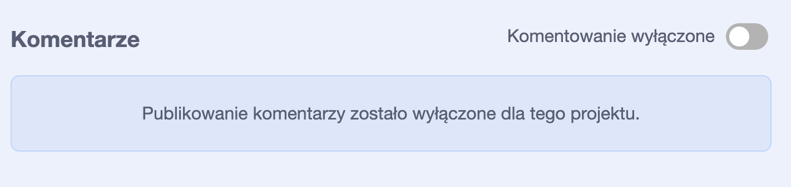
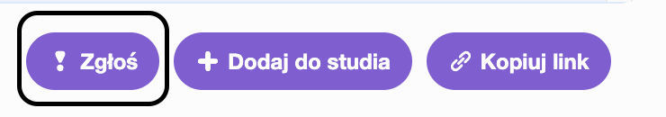

Scratch daje możliwość komentowania własnych i cudzych projektów. Jeśli nie chcesz pozwalać ludziom komentować twojego projektu, powinieneś wyłączyć komentowanie. Aby wyłączyć komentowanie, przejdź do strony projektu i ustaw suwak nad polem **Komentarze** na **Komentarze wyłączone**:

{:width="300px"}

Jeśli jesteś zadowolony i czujesz się bezpiecznie, pozwalając innym na pisanie komentarzy do twojego projektu, możesz zostawić pierwszy komentarz:

--- no-print ---

--- /no-print ---

--- /challenge ---

{:width="300px"}

--- /print-only ---

Jeśli uważasz, że komentarz lub projekt jest złośliwy, obraźliwy, zbyt brutalny lub w inny sposób nieodpowiedni, kliknij przycisk **Zgłoś**, aby powiadomić o tym zespół Scratch. Aby zgłosić komentarz, kliknij przycisk **Zgłoś** nad komentarzem. Aby zgłosić projekt, kliknij przycisk **Zgłoś** na stronie projektu:

{:width="250px"}

Przeczytaj [Wytyczne dla społeczności Scratch](https://scratch.mit.edu/community_guidelines){:target="_blank"}, aby wiedzieć, jak Ty i inni możecie utrzymywać przyjazną i kreatywną społeczność.
