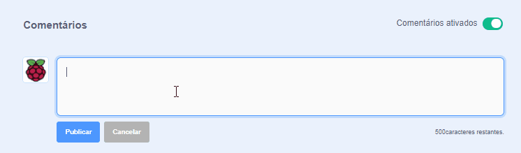
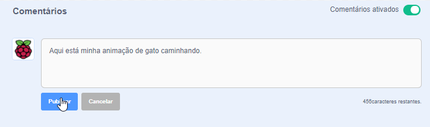

O Scratch permite comentar em seu próprio projeto e em projetos dos outros. Se você não quiser permitir que as pessoas comentem seu projeto, desative os comentários. Para desativar os comentários, vá para a página do projeto e defina o controle deslizante acima da caixa **Comentários** **Comentários desativados**:

{:width="300px"}

Se você está feliz e se sentir seguro/a em permitir que pessoas escrevam comentários em seu projeto, pode deixar um comentário primeiro:

--- no-print ---

--- /no-print ---

--- print-only ---

{:width="300px"}

--- /print-only ---

Se você acha que um comentário ou projeto é maldoso, insultuoso, violento demais ou de alguma forma inapropriado, clique no botão **Reportar** para informar a Equipe Scratch sobre isso. Para denunciar um comentário, clique no botão **Denunciar** acima do comentário. Para denunciar um projeto, clique no botão **Denunciar** na Página do Projeto:

{:width="250px"}

Leia as [Diretrizes da Comunidade Scratch](https://scratch.mit.edu/community_guidelines){:target="_blank"} para que você saiba como você e outras pessoas podem manter uma comunidade amigável e criativa.
