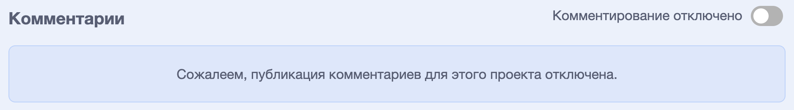
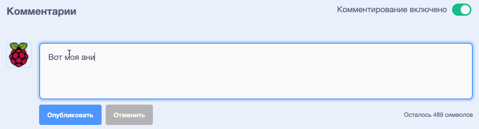
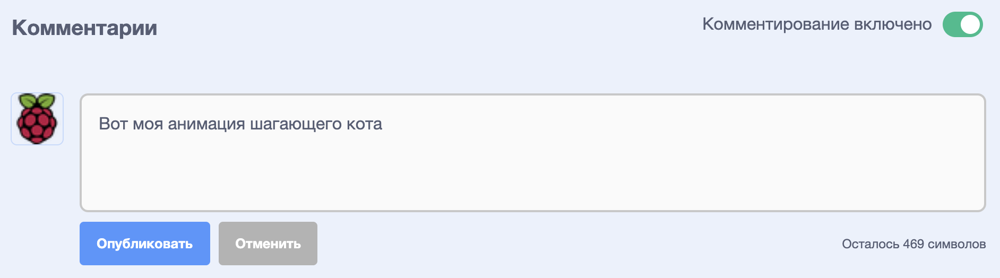

Scratch дает возможность комментировать свои и чужие проекты. Если ты не хочешь, чтобы люди комментировали твой проект, отключи комментирование. Чтобы отключить комментирование, перейди на страницу проекта и установи ползунок над полем **Комментарии** в положение **Комментирование отключено**:

{:width="300px"}

Если ты счастлив и чувствуешь себя в безопасности, позволив людям писать комментарии к твоему проекту, ты можешь оставить первый комментарий:

--- no-print ---

--- /no-print ---

--- print-only ---

{:width="300px"}

--- /print-only ---

Если ты считаешь, что комментарий или проект являются грубыми, оскорбительными, слишком жестокими или неуместными по другим причинам, нажми кнопку **Сообщить** , чтобы сообщить об этом Команде Scratch. Чтобы пожаловаться на комментарий, нажми кнопку **Пожаловаться** над комментарием. Чтобы пожаловаться на проект, нажми кнопку **Пожаловаться** на странице проекта:

{:width="250px"}

Прочти [Принципы сообщества Scratch](https://scratch.mit.edu/community_guidelines){:target="_ blank"}, чтобы знать, как ты и другие можете поддерживать дружелюбное и творческое сообщество.
