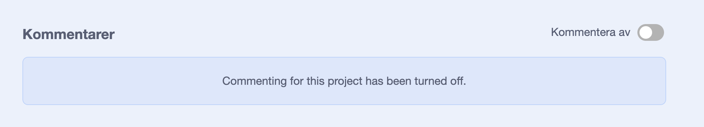
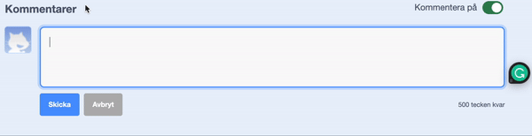
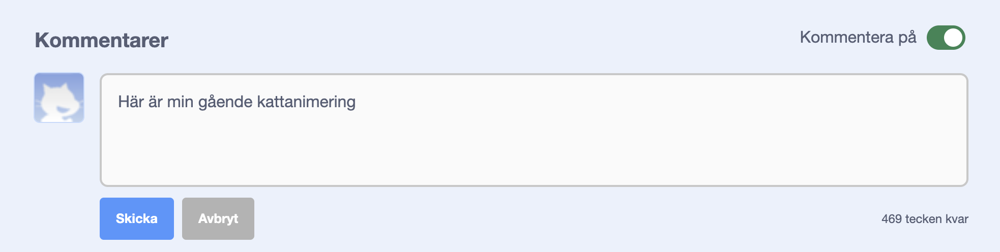
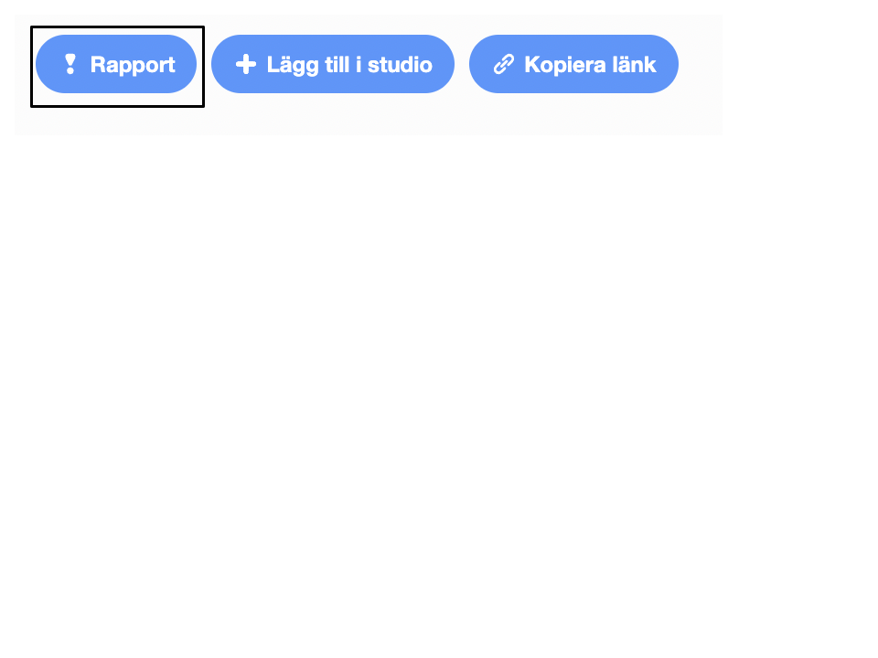

Scratch gör det möjligt att kommentera på dina egna och andras projekt. Om du inte vill att andra ska kunna kommentera på ditt projekt bör du stänga av kommentarer. För att stänga av kommentarer, gå in på projektsidan och ställ in reglaget ovanför rutan **Kommentarer** till **Kommentarer av**:

{:width="300px"}

Om du är glad och känner dig okej med att låta andra skriva kommentarer på ditt projekt kan du lämna den första kommentaren:

--- no-print ---

--- /no-print ---

--- print-only ---

{:width="300px"}

--- /print-only ---

Om du tycker att en kommentar eller ett projekt är elakt, förolämpande, för våldsamt eller på annat sätt olämpligt, klicka på **Rapportera**-knappen för att informera Scratch-teamet om det. För att rapportera en kommentar, klicka på **Rapportera**-knappen över kommentaren. För att rapportera ett projekt, klicka på **Rapportera**-knappen på projektsidan:

{:width="250px"}

Läs [Scratch Användarvilkor](https://scratch.mit.edu/community_guidelines){:target="_blank"} så att du vet hur du och andra kan upprätthålla en vänlig och kreativ gemenskap.
