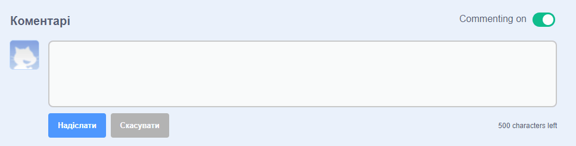
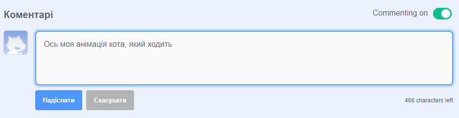

Scratch надає можливість коментувати свої та чужі проєкти. Якщо ти не хочеш, щоб люди коментували твій проєкт, тобі слід вимкнути коментарі. Щоб вимкнути коментарі, перейди на сторінку проєкту та встанови повзунок над полем **Коментарі** в положення **Вимкнути коментарі**:

{:width="300px"}

Якщо ти з радістю і з впевненістю дозволяєш людям писати коментарі до твого проєкту, ти можеш залишити перший коментар:

--- no-print ---

--- /no-print ---

--- print-only ---

{:width="300px"}

--- /print-only ---

Якщо ти вважаєш, що коментар або проєкт є поганим, образливим, занадто жорстоким або іншим чином неприйнятним, натисни кнопку **Повідомити**, щоб повідомити про це команду Scratch. Щоб поскаржитись на коментар, натисни кнопку **Повідомити**, яка знаходиться над коментарем. Щоб поскаржитись на проєкт, натисни кнопку **Повідомити**, яка знаходиться на Сторінці проєкту:

{:width="250px"}

Прочитай [Правила спільноти Scratch](https://scratch.mit.edu/community_guidelines){:target="_blank"}, щоб дізнатись, як ти та інші люди можуть підтримувати дружню та творчу спільноту.
