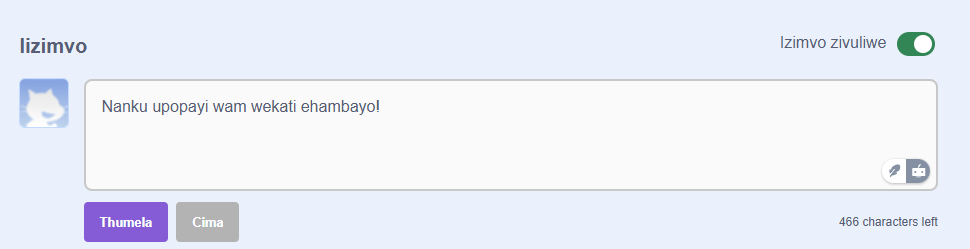

UScratch ukunika isakhono sokuba ukwanzi ukugqabaza kumsebenzi wakho kunye nowabanye abantu. Ukuba awufuni ukuvumela abantu banike amagqabantshintshi kwiprojekthi yakho, kufanele ucime isakhono sabo sokunik' ugqabazo. Ukucima isakhono samagqabantshintshi, yiya kwiPhepha leProjekthi kwaye utyibilizise isityibilizisi esingaphezulu kwebhokisi yama-**Magqabantshintshi** ibengu **Cima Magqabantshintshi**:

{:width="300px"}

Ukuba uziva ukhuselekile ukuvumela abantu ukuba babhale izimvo kwiprojekthi yakho, unobhala amagqabantshintshi okuqala:

--- no-print ---

--- /no-print ---

--- print-only ---

{:width="300px"}

--- /print-only ---

Ukuba ucinga ukuba uluvo okanye iprojekthi ikhohlakele, iyathuka, inobundlobongela kakhulu, okanye ayifanelekanga, cofa iqhosha **Xelo** ukwazisa iQela likaScratch ngayo. Ukuze uxele ngezimvo, cofa iqhosha elithi **Xela** ngaphezulu kwegqabantshintshi. Ukuxela iprojekthi, cofa iqhosha **Xelo** kwiPhepha leProjekthi:

{:width="250px"}

Funda [iziKhokelo zoLuntu lukaScratch](https://scratch.mit.edu/community_guidelines){:target="_blank"} ukuze wazi ukuba wena nabanye ninokugcina njani uluntu olunobuhlobo kunye nobuchule.
